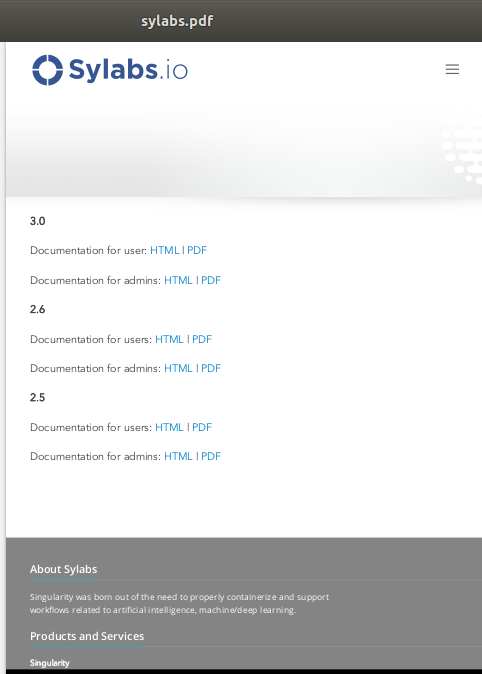

# URL-to-PDF API

This page will demonstrate an example of packaging a service into a container and running it. The service we will be packaging is an API server that converts a web page into a PDF,i.e., can convert any URL or HTML content to a PDF file or an image (PNG/JPEG) and can be found [here](https://github.com/alvarcarto/url-to-pdf-api). This service is useful when you need to automatically produce PDF files for receipts, weekly reports, invoices, or any other type of content.

Follow the steps below to build an image required for running this service or you can just download the final image directly from Container Library, simply run
`singularity pull library://sylabs/doc-examples/url-to-pdf:latest`.


### Building the image 

This section will describe the requirements for creating the definition file (url-to-pdf.def) that will be used to build the container image. `url-to-pdf-api` is based on a Node 8 server that uses a headless version of Chromium called [Puppeteer](https://github.com/GoogleChrome/puppeteer). Let’s first choose a base from which to build our container, in this case the docker image `node:8` which comes pre-installed with Node 8 has been used:


```
Bootstrap: docker
From: node:8
Includecmd: no
```
Puppeteer also requires a few dependencies to be manually installed in addition to Node 8, so we can add those into the post section as well as the installation script for the url-to-pdf:

```
%post

    apt-get update && apt-get install -yq gconf-service libasound2 \
        libatk1.0-0 libc6 libcairo2 libcups2 libdbus-1-3 libexpat1 \
        libfontconfig1 libgcc1 libgconf-2-4 libgdk-pixbuf2.0-0 \
        libglib2.0-0 libgtk-3-0 libnspr4 libpango-1.0-0 \
        libpangocairo-1.0-0 libstdc++6 libx11-6 libx11-xcb1 libxcb1 \
        libxcomposite1 libxcursor1 libxdamage1 libxext6 libxfixes3 libxi6 \
        libxrandr2 libxrender1 libxss1 libxtst6 ca-certificates \
        fonts-liberation libappindicator1 libnss3 lsb-release xdg-utils \
        wget curl && rm -r /var/lib/apt/lists/*
    git clone https://github.com/alvarcarto/url-to-pdf-api.git pdf_server
    cd pdf_server
    npm install
    chmod -R 0755 .
```
And now we need to define what happens when we start an instance of the container. In this situation, we want to run the commands that starts up the url-to-pdf server:

```
%startscript
    cd /pdf_server
    # Use nohup and /dev/null to completely detach server process from terminal
    nohup npm start > /dev/null 2>&1 < /dev/null &
```

Also, the url-to-pdf server requires some environment variables to be set, which we can do in the environment section:

```
%environment
    NODE_ENV=development
    PORT=9000
    ALLOW_HTTP=true
    URL=localhost
    export NODE_ENV PORT ALLOW_HTTP URL
```
```
$ sudo singularity build url-to-pdf.sif url-to-pdf.def
```
### Running the Service 

We can now start an instance and run the server:

$ sudo singularity instance start url-to-pdf.sif pdf
Note

If there occurs an error related to port connection being refused while starting the instance or while using it later, you can try specifying different port numbers in the definition file above.

We can confirm it’s working by sending the server an http request using curl:

```
$ curl -o sylabs.pdf localhost:9000/api/render?url=http://sylabs.io/docs

% Total    % Received % Xferd  Average Speed   Time    Time     Time  Current
                         Dload  Upload   Total   Spent    Left  Speed

100 73750  100 73750    0     0  14583      0  0:00:05  0:00:05 --:--:-- 19130
```

You should see a PDF file being generated like the one shown below:


