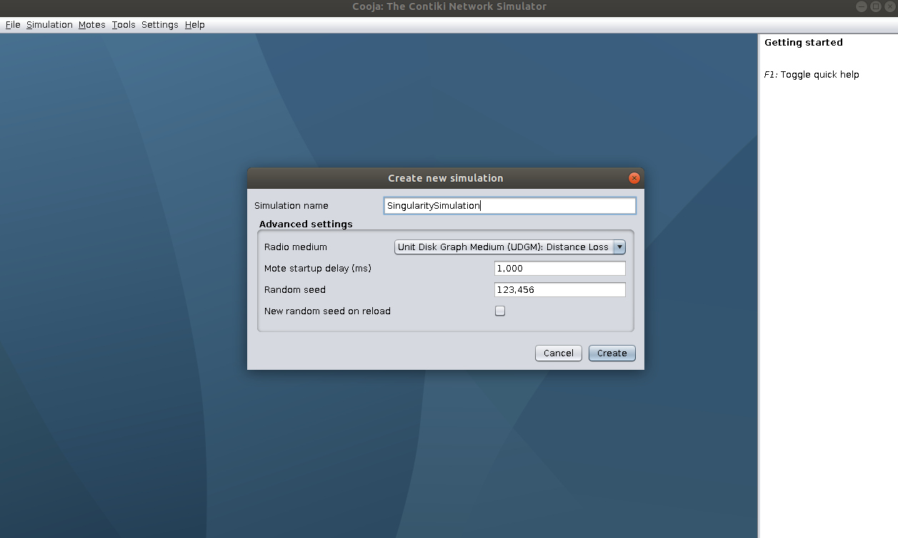

The Contiki Operating System for IoT
====================================

Contiki is an open source operating system that runs on tiny low-power
microcontrollers and makes it possible to develop applications that
make efficient use of the hardware while providing standardized
low-power wireless communication for a range of hardware platforms.

Contiki is used in numerous commercial and non-commercial systems,
such as city sound monitoring, street lights, networked electrical
power meters, industrial monitoring, radiation monitoring,
construction site monitoring, alarm systems, remote house monitoring,
and so on.

For more information, see the Contiki website [here](http://contiki-os.org).

In this example, we will build a Singularity container with ContikiOS.
We will base this example on the `contiki.def` (`def` for definition) file.
First, we will go through an explanation of every section inside the `contiki.def` file:

#### Environment section:

Here we define all the needed environment variables for ContikiOS to work fine.
For this specific example the only needed variable is `CONTIKI` which is set to the
path of the installation of contiki in the container.

#### Help section:

Here we define the description of the container, in this case this container has
ContikiOS as well as all the examples that come along including the Cooja simulator. We will test the functionality
of this container by running a `Hello world` example below, by command line and by simulator.
The help section also displays the correct way to run your container.

#### Post section:

Here we define the needed dependencies to be installed in order to make ContikiOS run smoothly.
One thing that is important is the set up of the dependencies for the specific architecture.
The following example is based on a 64-bit architecture.

Some other needed dependencies include the Java installation as well as the support for MSP430-based platforms and Java for Cooja.

#### Runscript section:

Here all the needed commands to run the ContikiOS example are specified. More in detail, the Hello-world example provided from Contiki is run to know that the installation inside the container has been successful.


How to build my Singularity ContikiOS container:
================================================

To build this container, you will need the following:

 - Singularity, which you can download and install from [here](https://github.com/sylabs/singularity).
 - A text editor, like: `micro`, `vim` or `nano`.
 - Root access.

#### Build the container:

We will build and save the container into the `~/contiki` folder. Make sure you have this folder before following the example. Go inside this folder in your host:

```
$ mkdir ~/contiki
$ cd ~/contiki
```

You can obtain the contiki definition file like so:

```
$ wget https://raw.githubusercontent.com/sylabs/examples/master/iot/contiki/contiki.def
```


And then, once you already have the def file, you can build the container with a single command like this:

```
$ sudo singularity build contiki.sif contiki.def
```

After this, you are ready to set up your container before running the example.

#### Set up:

First make sure to create the directory structure as follows:

```
$ mkdir -p ~/contiki/{examples/hello-world,tools}
```

After this, your directory structure will look like this:

```
~/contiki
|     |--examples
|     |        \--hello-world
|     \--tools
```

Another task to do before using the container is to copy certain code that resides inside the container and that will be later bound into your host. To do this, you will first shell into the container like so:

```
$ sudo singularity shell contiki.sif
```

Now that you are inside the container you can copy all the needed code for compilation:

```
Singularity contiki.sif:~/contiki> cp -a /contiki/examples/hello-world/* ./examples/hello-world/
```

With that, you are copying all the content on `/contiki/examples/hello-world` folder from the container to your `/contiki/examples/hello-world` folder on your host. We do this because we will need to compile the `hello-world` example and so, this will be a bind point.

Do this same process but now with the `/contiki/tools` folder. We will need this to run the `hello-world` program in the Cooja simulator.

```
Singularity contiki.sif:~/contiki> cp -a /contiki/tools/* ./contiki/tools/
```

This will copy all the content from `/contiki/tools` folder in your container to your host. We will need to compile the Cooja simulator code so this will be another bind point considered in the next steps.

Now exit the container. We will need to bind some paths at this point.

#### Bind paths:

You can bind the paths from host to container and shell into the container like so in a single command:

```
$ sudo singularity shell --bind ~/contiki/examples/hello-world:/contiki/examples/hello-world,~/contiki/tools:/contiki/tools contiki.sif
```

After this, inside the container you can run the `hello-world` example.

#### Running the hello world example on command line:

```
Singularity contiki.sif:~/contiki> cd /contiki/examples/hello-world
Singularity contiki.sif:~/contiki/examples/hello-world> make TARGET=native
Singularity contiki.sif:~/contiki/examples/hello-world> ./hello-world.native
```

And voilà, you should see an output like this after running that last command:

```
Singularity contiki.sif:~/contiki/examples/hello-world> ./hello-world.native
Contiki 3.0 started with IPV6, RPL
Rime started with address 1.2.3.4.5.6.7.8
MAC nullmac RDC nullrdc NETWORK sicslowpan
Tentative link-local IPv6 address fe80:0000:0000:0000:0302:0304:0506:0708
Hello, world
```
#### Running the hello world example from the Cooja simulator:

To run the Cooja simulator, you will need to move inside the container to the `/contiki/tools/cooja` folder. From there, run the following command to run the `Cooja simulator`:

```
Singularity contiki.sif:~/contiki/examples/hello-world> cd /contiki/tools/cooja
Singularity contiki.sif:~/contiki/tools/cooja> JAVA_TOOL_OPTIONS=-Dfile.encoding=UTF8 ant run
```

You will see the `Cooja simulator` start, from the upper panel option, start a new simulation.

We will call the simulation `SingularitySimulation`. You should see something similar to the picture below.



Then, add a new node from the upper panel options, we will choose the type `Sky mote`.

For the node, we will select the `/contiki/examples/hello-world/hello-world.c` code. Select it and compile it, you should see some similar output as the image below.


After this process, hit `Start` to start the simulation and you will see the following output from the node as shown from the image below:


